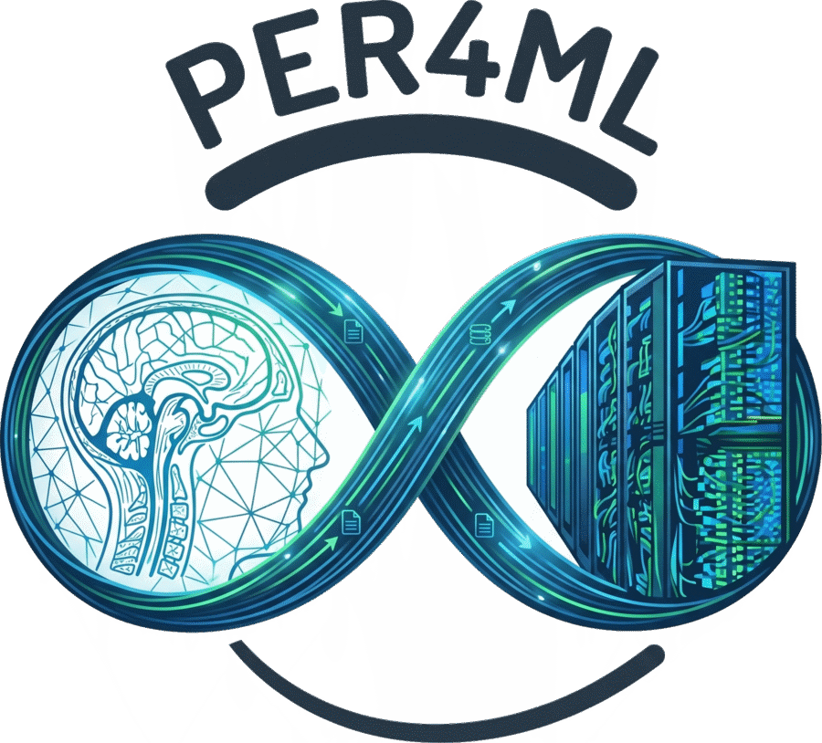

<div align="center">
  
  <h1>Per4ML lab website</h1>
  <p><strong><a href="https://per4ml.github.io">per4ml.github.io</a></strong><br>
  Performance Engineering &amp; Machine Learning · Texas State University</p>
</div>

Source for the Per4ML group site. Built with React + Vite; all content comes from
plain data files in [`contents/`](contents/).

**Every push to `main` rebuilds and republishes the site automatically** (about
1–2 minutes). You never build or upload anything by hand. `main` is protected, so
changes arrive as pull requests — see below.

---

## Lab members: two things you can add yourself

Both take a couple of minutes in your browser. Nothing to install.

First, ask Dr. Islam for **write access** to this repo and accept the emailed invite.

### Add a photo to the gallery

1. **Resize it** to about 1600 px wide. *(Mac: open in Preview → Tools → Adjust Size.
   Windows: Photos → ⋯ → Resize.)* Don't upload a photo straight off your phone —
   those are 3–8 MB and bloat the repo forever.
2. **Upload it** to [`public/images/gallery/`](public/images/gallery) using
   **Add file → Upload files**.
3. **Add your caption** to [`contents/gallery.json`](contents/gallery.json), newest first:

   ```json
   {
     "image": "images/gallery/your-photo.jpg",
     "caption": "Yourname@Venue'26"
   }
   ```

4. Choose **"Create a new branch and start a pull request"**, then ask Dr. Islam to review.

Two things to get right: the `image` path has **no leading slash and no `public/`**,
and the caption is **one short line** like `Zaeed@MUG'26` or `Per4ML@SC'26` (use
`Us@…` for group photos). Keep it under ~60 characters.

### Link your name to your own website

1. Open [`contents/members.json`](contents/members.json) and find your entry.
2. Put your address in the `url` field — `"url": "https://your-site.com"`.
3. Commit to a new branch and open a pull request.

Your card in *Meet the Team* becomes clickable. A personal site, GitHub, Google
Scholar, or LinkedIn all work. Leave everyone else's entry alone.

*Want your headshot on your card too?* Upload it to
[`public/images/members/`](public/images/members) (800 px wide is plenty) and point
your `image` field at it, e.g. `images/members/yourname.jpg`.

> **If the site doesn't update after your PR is merged,** check the **Actions** tab.
> A red ✗ is almost always a JSON typo — a trailing comma after the last entry, a
> missing comma between entries, or curly `"` quotes pasted in from Word or Slack.

---

## Maintainer guide

### What drives each section

| Section on the site | Edit this | Then run |
| --- | --- | --- |
| Publications, word cloud, mindmap, stats | `contents/pubs.bib` | `python3 scripts/bib2json.py` |
| Word-cloud seed keywords | `contents/keywords.json` | `python3 scripts/bib2json.py` |
| Meet the Team | `contents/members.json` | — |
| Alumni | `contents/alumni.json` | — |
| Collaborators | `contents/collaborators.json` | — |
| Recent Updates (news) | `contents/news.json` | — |
| Life in the Lab (gallery) | `contents/gallery.json` | — |
| Research Projects carousel | `contents/projects.json` | — |
| Our Funders | `contents/funders.json` | — |
| PI bio, funding total, contact email | `contents/pi.json` | — |

Entries marked — need no script; the site picks them up on the next build.

A team member with `"active": false` moves to **Alumni** automatically, labelled by
their level (Ph.D. / M.Sc. / B.Sc.). Use `contents/alumni.json` when you need a
custom note instead, like `"Ph.D., 2026, Intel"`.

### The content form

Rather than editing JSON by hand, you can run a local form that writes into the right
file for you (team member, news item, project, funder, or paper):

```bash
npm run admin        # then open http://localhost:8787
```

It appends and merges — it never wipes existing entries. The form runs on your laptop
only and is never deployed.

### Working locally

```bash
npm install                       # once
pip install -r requirements.txt   # once, for the Python scripts
npm run dev                       # live preview on http://localhost:3000
```

`npm run dev` and `npm run build` re-run the BibTeX and SEO scripts for you. To check
the real production build, use `npm run build && npm run preview`. `npm run lint`
type-checks without building.

### Publishing

```bash
git add -A
git commit -m "Describe what changed"
git push
```

The site rebuilds and redeploys on its own. Hard-refresh with **Cmd-Shift-R** if you
still see the old version.

### CSV importers

Three sections can also be bulk-loaded from CSV. These are **not** part of the build —
run them yourself, from inside `scripts/`:

```bash
cd scripts
python3 update_members.py     # from contents/Team+Members.csv
python3 update_news.py        # from contents/news.csv  (--sort-csv also re-sorts it)
python3 update_projects.py    # from contents/Rsearch+Projects2.csv
```

All three merge by `id` and preserve your manual edits.

---

## Never edit these by hand

They're regenerated on every build, so changes to them are silently overwritten:

`index.html` (the JSON-LD block between the markers) · `public/llms.txt` ·
`public/sitemap.xml` · `public/robots.txt` · `public/publications.json` ·
everything in `src/data/` and `dist/`

Edit the source in `contents/` instead. `scripts/generate_seo.py` regenerates the
structured data on every build — schema.org JSON-LD, keywords, `llms.txt`, `robots.txt`,
and `sitemap.xml` — so search engines and AI assistants stay current with no manual step.

## How deployment works

`.github/workflows/deploy.yml` runs on every push to `main`: it installs
dependencies, runs `npm run build` (which regenerates publications and SEO data),
and publishes `dist/` to GitHub Pages.

`main` is protected by the **Protect main** ruleset: changes need a pull request with
one approval, and the branch can't be deleted or force-pushed. Organization admins can
push directly.

## Layout

```
contents/          content you edit — JSON + BibTeX
public/images/     gallery/, members/, projects/, lab/
src/components/    one file per section of the page
scripts/           BibTeX → JSON, SEO generation, CSV importers
admin/             the local content-entry form
```
